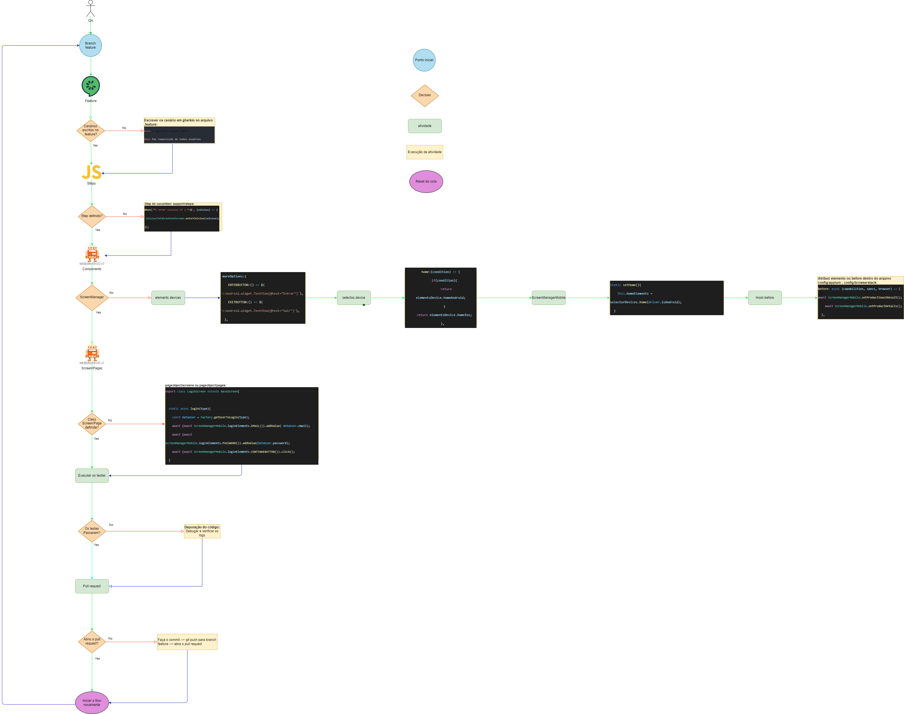

# Framework appium+Wdio+cucumber

# Estrutura do Framework

## 1. Feature:
**Criação da branch feature e Desenvolvimento/Adaptação de cenários para automação - Gherkin**

## 2. Steps:
**Escrever os steps do cenários em cucumber com a linguagem javascript**

## 3. ScreenManager:

**Mapear os seletores no módulo e atribuir os seletores ao ScreenManager**

## 4. Screen/Pages:

**Desenvolver o script para o comportamento o driver no ambiente nativo/web**

## 5 Execução dos testes

# Base

- WebdriverIO v6
- cucumber v6
- Node version 16.14
- Appium

# Auxiliares

- Native Android and iOS apps
- Android Chrome browser
- iOS Safari browser
- Supports Page Object Model
- Cenários em gherkin com a escrita de cucumber
- Reports cucumber html reports

# Fontes do framework

- [cucumber](https://cucumber.io/)
- [webdriverIo](https://webdriver.io/)
- [autocompletion-wdio](https://webdriver.io/docs/autocompletion/)
- [Appium Introduction](http://appium.io/docs/en/about-appium/intro/)
- [Appium Capabilities](http://appium.io/docs/en/writing-running-appium/caps/)
- [Running Appium Tests](http://appium.io/docs/en/writing-running-appium/running-tests/)
- [UiSelector - android](https://developer.android.com/reference/androidx/test/uiautomator/UiSelector)
- [UIAutomation](https://web.archive.org/web/20120523220502/http://developer.apple.com/library/ios/#documentation/ToolsLanguages/Reference/UIATargetClassReference/UIATargetClass/UIATargetClass.html)

# Configurações inicias

### Instale as dependências

- Executar o comando `npm i` no terminal

### Configuração dos dispositivos

**Android:**

 *Alterações a serem observadas:*

 1. platformName
 2. automationName
 3. deviceName
 4. platformVersion
 appName

- config/appium/android/android.config.js
~~~js
       config.capabilities = [
    {
        platformName: 'Android',
        noReset: true,
        fullReset: false,
        maxInstances: 1,
        automationName: 'uiautomator2',
        deviceName: AndroidInfo.deviceName(),
        platformVersion: AndroidInfo.platFormVersion(),
        app: path.resolve(`./apps/${AndroidInfo.appName()}`)
    }
];
~~~

- config/android.info.js
~~~js
class AndroidInfo {
    static deviceName() {
        return 'emulator-5554'; // colocar o id do dispostivo: para verificar utilize o comando: emulator -list-avds
    }

    static platFormVersion() {
        return '10.0'; // Versão que você baixou no android studio
    }

    static appName() {
        return 'Celsius Fahrenheit Converter_v1.0.1_apkpure.com.apk'; // nome o apk
    }
}

~~~

**Ios:** config/ios.config.js e config/ios.info.js *Segue a mesma situação do android*

# Comandos para Executar

### Ios

- Execute `npm run ios` executar o Ios do app

- Execute `npm run iosBrowser` executar o ios pelo Safari

### Android

- Execute `npm run android` executar o app do android
- Execute `npm run androidBrowser` executar o android pelo browser

# Eslint Cypress

### Aplicando boas práticas com o eslint

**Fonte**: [eslint-plugin](https://github.com/cypress-io/eslint-plugin-cypress)

**Run** `npm run lint`

# Padronização para Seletores

## Android

### **id**

~~~yml
sintaxe: id:{valor do id}
~~~
**Exemplo**
`id:com.androiddev2015.cfconverter:id/btncnvCF`

### **accessibility ID**

~~~yml

sintaxe: ~content-desc

~~~

### **class**

~~~yml

sintaxe: class
~~~

**Exemplo**
`android.widget.Button`

### **xpath: text/index/id**

~~~yml

sintaxe-text: //class[contains(@text, "valor do texto")]
sintaxe-index: //class[@index="0"]

~~~
**Exemplo**
`//android.widget.Button[contains(@text, "CONVERT ${value}")]`

## IOS

### **Predicate string**

~~~yml

sintaxe: const selector = `type == 'XCUIElementTypeSwitch' && name CONTAINS 'Allow'`
const switch = await $(`-ios predicate string:${selector}`)
~~~

### **class chain**

~~~yml

sintaxe: '-ios class chain:**/XCUIElementType{Table/Cell/...}[`name "..."`]'

const selector = '**/XCUIElementTypeCell[`name BEGINSWITH "D"`]/**/XCUIElementTypeButton'
const button = await $(`-ios class chain:${selector}`)

~~~

# WDIO-V6

## INSTALL
`npm i @wdio/appium-service@6.12.1 @wdio/cli@6.12.1 @wdio/cli@6.12.1 @wdio/local-runner@6.12.1 @wdio/spec-reporter@6.11.0 wdio-chromedriver-service@6.0.4 @wdio/cucumber-framework@6.11.1 @wdio/mocha-framework@6.11.0 --save-dev`

`npm i wdio-cucumberjs-json-reporter@2.0.4 cucumber`

## UNINSTALL
`npm uninstall @wdio/appium-service @wdio/cli @wdio/cli @wdio/local-runner @wdio/spec-reporter wdio-chromedriver-service @wdio/cucumber-framework @wdio/mocha-framework wdio-cucumberjs-json-reporter cucumber`

# V7 -

## INSTALL
`npm i @wdio/appium-service@7.16.14 @wdio/cli@7.16.14 @wdio/local-runner@7.16.14 @wdio/spec-reporter@7.16.14 wdio-chromedriver-service@7.2.6 @wdio/cucumber-framework@7.16.14 @wdio/mocha-framework@7.16.14 --save-dev`

`npm i @cucumber/cucumber@7.3.2 wdio-cucumberjs-json-reporter@4.4.1`

# UNINSTALL
`npm uninstall @wdio/appium-service @wdio/cli @wdio/local-runner @wdio/spec-reporter wdio-chromedriver-service @wdio/cucumber-framework @wdio/mocha-framework @cucumber/cucumber wdio-cucumberjs-json-reporter`

